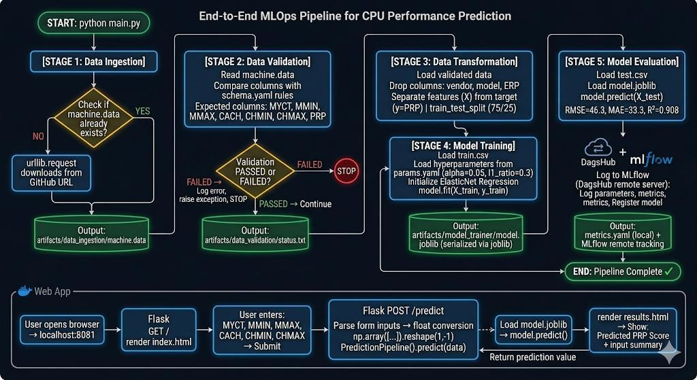
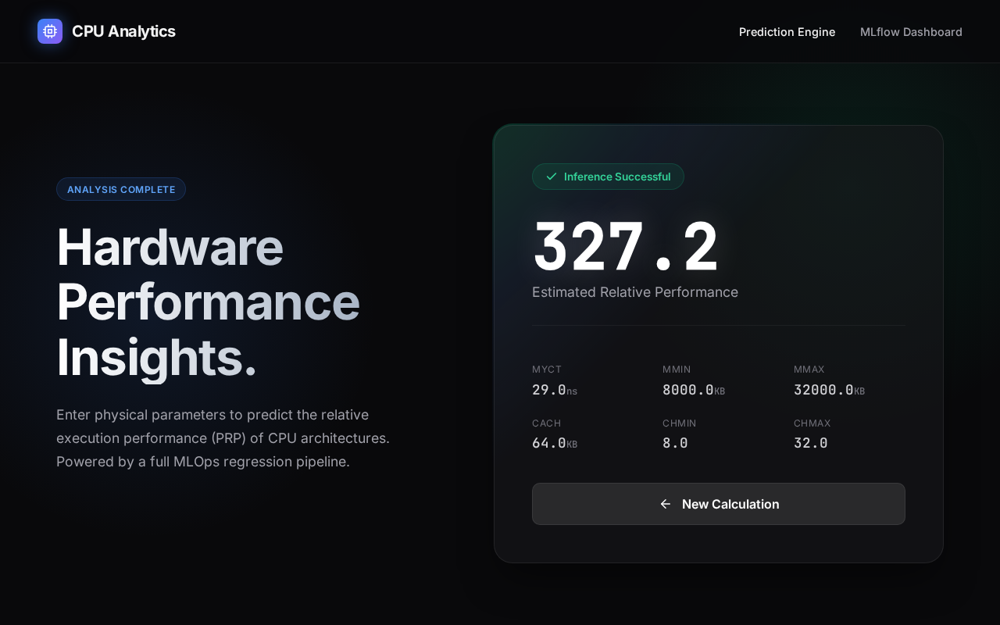

# 💻 CPU Performance Prediction Project


A complete end-to-end Machine Learning pipeline built for predicting CPU performance based on hardware specifications. This project follows industry-standard MLOps practices, featuring modular components, clear configuration management, MLflow experiment tracking on DagsHub, and a beautifully designed high-end Flask-based web interface.

*(Path: `desktop/eee` - Reference: `11 22 33`)*

---

## 💻 Getting Started (Installation & Setup)

Follow these step-by-step instructions to download and run the project on your local machine:

**Step 1: Clone the repository**
```bash
git clone https://github.com/aboodcs/datascienceproject.git
cd datascienceproject
```

**Step 2: Create a virtual environment**
It's highly recommended to use an isolated environment to manage dependencies:
```bash
python3 -m venv env
source env/bin/activate
```

**Step 3: Install dependencies**
Install all required libraries for the pipeline and the web application:
```bash
pip install -r requirements.txt
```

**Step 4: Execute the ML pipeline**
Run the main script to trigger data ingestion, validation, transformation, model training, and evaluation. This will train the model and generate all artifacts:
```bash
python main.py
```

**Step 5: Launch the Web Application**
Once the model is trained, start the Flask server to interact with the web UI:
```bash
python app.py
```
*Open your browser and go to `http://localhost:8081` (or the port specified in your terminal) to start predicting CPU performance!*

---

## 🏗️ Project Architecture & Pipeline Stages



The entire pipeline is built step-by-step, exactly reflecting the code inside the `src/datascience/components` and `src/datascience/pipeline` directories. This is exactly what happens when you run `main.py` in the project:

### 1. 📥 Data Ingestion (`data_ingestion_pipeline.py`)
- **What happens:** The pipeline downloads the raw `machine.data` file directly from the remote GitHub URL using `urllib.request`. If it already exists, it skips the download.
- **Output:** The dataset is saved locally to `artifacts/data_ingestion/machine.data`.

### 2. 🧹 Data Validation (`data_validation_pipeline.py`)
- **What happens:** The validation component reads `machine.data` and strictly compares the columns against the rules defined in `schema.yaml`. It ensures all required columns (MYCT, MMIN, MMAX, CACH, CHMIN, CHMAX, PRP) are present and correctly formatted.
- **Output:** A file is written to `artifacts/data_validation/status.txt` confirming if validation `Passed` or `Failed`.

### 3. 🔄 Data Transformation (`data_transformation_pipeline.py`)
- **What happens:** The pipeline checks if the validation status is "Passed". If so, it proceeds. The raw data contains non-predictive features. This component specifically **drops** the `vendor`, `model`, and `ERP` columns. It then applies `train_test_split` from `scikit-learn` to split the data (75% train, 25% test).
- **Output:** Fully processed datasets are saved as `train.csv` and `test.csv` in `artifacts/data_transformation/`.

### 4. 🤖 Model Training (`model_trainer_pipeline.py`)
- **What happens:** The training component loads the processed `train.csv`. It separates the features from the target variable (`PRP`). It then trains an **ElasticNet Regression** model using hyperparameters `alpha=0.05` and `l1_ratio=0.3` (loaded dynamically from `params.yaml`) with `random_state=42`.
- **Output:** The trained model is serialized using `joblib` and saved to `artifacts/model_trainer/model.joblib`.

### 5. 📊 Model Evaluation & Tracking (`model_evaluation_pipeline.py`)
- **What happens:** The trained model is evaluated on the unseen `test.csv`. The script calculates **RMSE**, **MAE**, and an **R² Score**. 
- **Tracking:** These metrics, along with the model parameters, are logged directly to a remote **MLflow server hosted on DagsHub**. The model artifact is also securely registered in the registry.
- **Output:** A local `metrics.yaml` file is generated alongside the remote tracking in the `artifacts/model_evaluation/` directory.

---

## 🧱 Workflow Development Structure

When building an end-to-end ML pipeline, we follow a structured development order.  
The first three steps form the **foundation of every ML project** | **((((VERY IMPORTANT))))**.

### `config.yaml` , `schema.yaml` , `params.yaml`

---

### 1. ⚙️ Configuration Setup

Define all project settings and parameters:

- `config.yaml` → project paths, directories, pipeline configuration  
- `schema.yaml` → structure and validation rules of input data  
- `params.yaml` → model hyperparameters and tuning settings  

👉 **Purpose:** Centralize all configurations so the project is flexible and easy to manage.

---

### 2. 🧬 Entity Definitions

Define data classes (entities) for configurations and pipeline components (found in `src/datascience/entity/config_entity.py`).

👉 **Purpose:**
- Ensures type safety  
- Defines clear structure for each configuration section  
- Makes the pipeline more reliable and maintainable  

---

### 3. ⚙️ Configuration Manager (`src/config`)

Responsible for reading and managing configuration files (`src/datascience/config/configuration.py`).

It:
- Loads YAML files
- Converts them into Python objects
- Supplies them to components and pipelines

👉 **Purpose:** Provides a clean interface between configuration and code logic.

---

### 4. 🧩 Components Development

Each pipeline stage is implemented as an independent component within `src/datascience/components/`:

- `data_ingestion.py`  
- `data_validation.py`  
- `data_transformation.py`  
- `model_trainer.py`  
- `model_evaluation.py`  

👉 **Purpose:**
- Modular design  
- Reusable code  
- Easier debugging and testing  

---

### 5. 🔗 Pipeline Construction

All components are connected in a sequential workflow inside `src/datascience/pipeline/`.

---

## 🚀 Web Application

We developed a highly polished, professional dark-mode dashboard to interact with the trained ElasticNet model. The UI uses modern glassmorphism design, glowing accents, and jetbrains mono fonts for a premium developer feel. **These are actual screenshots of the running application, directly reflecting the `templates/index.html` frontend.**

### 1. The Performance Prediction Form
Users can enter the 6 core physical attributes of the CPU. The UI is built with vanilla CSS, utilizing glassmorphism, glowing gradients, and responsive grids. 
*(Actual screenshot from `localhost:8081`)*


### 2. The AI Analysis Results
The prediction is calculated instantly by loading `model.joblib`. The results page provides a clean breakdown of the estimated relative performance score alongside the submitted inputs in a visually pleasing success card.
*(Actual screenshot from `localhost:8081/predict`)*
