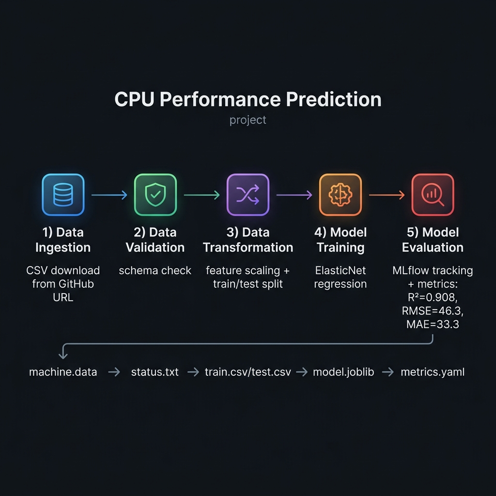
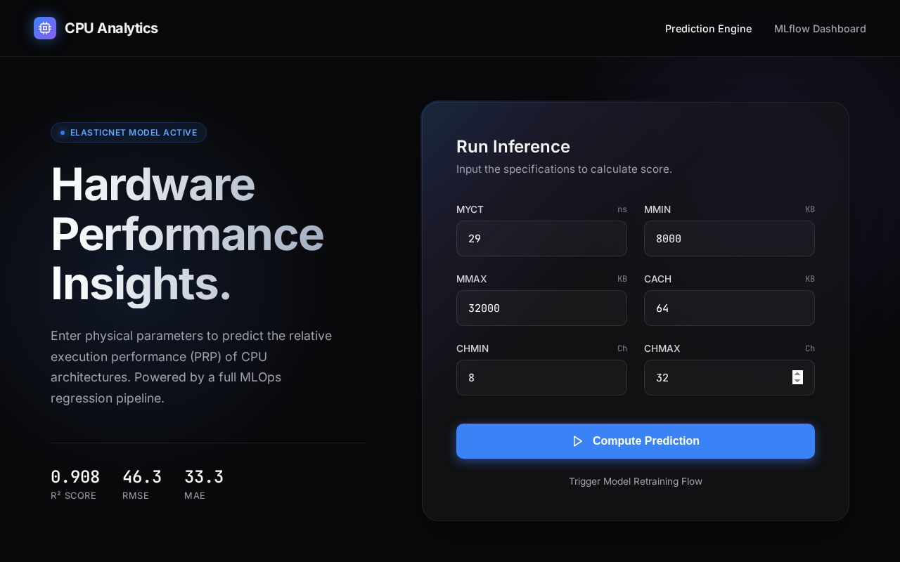

<div align="center">


# ⚡ CPU Performance Prediction
### *An End-to-End MLOps Regression Pipeline*

[](https://www.python.org/)
[](https://flask.palletsprojects.com/)
[](https://scikit-learn.org/)
[](https://mlflow.org/)
[](https://dagshub.com/)


> **Predict the Relative Performance (PRP) of CPU architectures** using physical hardware specifications.  
> Built with a production-grade, modular MLOps pipeline — from raw data ingestion all the way to a live Flask web application.

</div>

---

## 📋 Table of Contents

1. [🔍 Project Overview](#-project-overview)
2. [📊 Model Performance](#-model-performance)
3. [🗃️ Dataset](#️-dataset)
4. [🏗️ Project Architecture](#️-project-architecture)
5. [⚙️ Configuration Files](#️-configuration-files)
6. [🔁 ML Pipeline — Stage by Stage](#-ml-pipeline--stage-by-stage)
7. [🛠️ Development Workflow (SOP)](#️-development-workflow-sop)
8. [🚀 Getting Started](#-getting-started)
9. [🖥️ Web Application](#️-web-application)
10. [📈 MLflow Experiment Tracking](#-mlflow-experiment-tracking)
11. [🧰 Tech Stack](#-tech-stack)
12. [🤝 Contributing](#-contributing)

---

## 🔍 Project Overview

This project implements a **full end-to-end Machine Learning pipeline** to predict the **Relative Performance (PRP)** of CPU hardware based on 6 physical architecture features. It is modelled after real-world MLOps practices used in production environments and serves as a reference architecture for structured ML projects.

### ✨ Key Highlights

| Feature | Details |
|---|---|
| 🎯 **Task** | Regression — Predicting CPU Relative Performance |
| 🤖 **Algorithm** | ElasticNet (scikit-learn) |
| 📐 **Metric** | R² = **0.908**, RMSE = **46.3**, MAE = **33.3** |
| 🧪 **Experiment Tracking** | MLflow + DagsHub |
| 🌐 **Serving** | Flask REST API + Interactive Web UI |
| 🔧 **Architecture** | Modular Pipeline (5 independent stages) |
| 📦 **Config-Driven** | YAML-based configuration management |

---

## 📊 Model Performance

The trained **ElasticNet regression model** achieves strong predictive accuracy on the CPU performance dataset:

| Metric | Value | Description |
|---|---|---|
| **R² Score** | `0.908` | 90.8% of variance explained by the model |
| **RMSE** | `46.3` | Root Mean Squared Error on test set |
| **MAE** | `33.3` | Mean Absolute Error on test set |

> 📌 All metrics are automatically logged to **MLflow** on DagsHub after every training run.

---

## 🗃️ Dataset

The project uses the **[UCI Machine Learning Repository — Computer Hardware Dataset](https://archive.ics.uci.edu/ml/datasets/Computer+Hardware)**.

The raw data is fetched directly at runtime from:
```
https://raw.githubusercontent.com/HoussemLahmar/CPU-Performance-Prediction/main/machine.data
```

### 🔢 Feature Descriptions

| Feature | Type | Unit | Description |
|---|---|---|---|
| **MYCT** | `int64` | nanoseconds | Machine cycle time |
| **MMIN** | `int64` | KB | Minimum main memory |
| **MMAX** | `int64` | KB | Maximum main memory |
| **CACH** | `int64` | KB | Cache memory size |
| **CHMIN** | `int64` | channels | Minimum channels in units |
| **CHMAX** | `int64` | channels | Maximum channels in units |
| **PRP** ⭐ | `int64` | — | **Target: Published Relative Performance** |

> `PRP` is the target variable — the value the model learns to predict.

### Schema (`schema.yaml`)
```yaml
COLUMNS:
  MYCT: int64
  MMIN: int64
  MMAX: int64
  CACH: int64
  CHMIN: int64
  CHMAX: int64
  PRP: int64

TARGET_COLUMN:
  name: PRP
```

---

## 🏗️ Project Architecture

<div align="center">



</div>

The pipeline is organized into **5 sequential, independent stages**. Each stage produces artifacts consumed by the next, enabling a clean, reproducible workflow.

```
Raw Data (GitHub URL)
      │
      ▼
┌─────────────────┐
│  Data Ingestion │ ──► artifacts/data_ingestion/machine.data
└─────────────────┘
      │
      ▼
┌──────────────────┐
│ Data Validation  │ ──► artifacts/data_validation/status.txt
└──────────────────┘
      │
      ▼
┌───────────────────────┐
│ Data Transformation   │ ──► artifacts/data_transformation/train.csv
└───────────────────────┘                                   test.csv
      │
      ▼
┌────────────────┐
│ Model Training │ ──► artifacts/model_trainer/model.joblib
└────────────────┘
      │
      ▼
┌──────────────────┐
│ Model Evaluation │ ──► artifacts/model_evaluation/metrics.yaml
└──────────────────┘         (+ logged to MLflow / DagsHub)
      │
      ▼
┌──────────────────────┐
│  Flask Web App       │ ──► Live predictions at http://0.0.0.0:8081
└──────────────────────┘
```

---

## ⚙️ Configuration Files

This project follows a **config-driven design**. All settings are centralized in YAML files — no hardcoded paths or magic numbers in the source code.

### `config/config.yaml` — Pipeline Paths & Directories
```yaml
artifacts_root: artifacts

data_ingestion:
  root_dir: artifacts/data_ingestion
  source_URL: https://raw.githubusercontent.com/HoussemLahmar/CPU-Performance-Prediction/main/machine.data
  local_data_file: artifacts/data_ingestion/machine.data

data_validation:
  root_dir: artifacts/data_validation
  STATUS_FILE: artifacts/data_validation/status.txt

data_transformation:
  root_dir: artifacts/data_transformation
  data_path: artifacts/data_ingestion/machine.data

model_trainer:
  root_dir: artifacts/model_trainer
  train_data_path: artifacts/data_transformation/train.csv
  test_data_path: artifacts/data_transformation/test.csv
  model_path: model.joblib

model_evaluation:
  root_dir: artifacts/model_evaluation
  test_data_path: artifacts/data_transformation/test.csv
  model_path: artifacts/model_trainer/model.joblib
  metrics_file_path: artifacts/model_evaluation/metrics.yaml
```

### `params.yaml` — Model Hyperparameters
```yaml
ElasticNet:
  alpha: 0.05
  l1_ratio: 0.3
```

> 💡 Tuning the model is as simple as editing `params.yaml` and re-running `python main.py` — no code changes required.

---

## 🔁 ML Pipeline — Stage by Stage

### Stage 1 · 📥 Data Ingestion

**File:** `src/datascience/components/data_ingestion.py`

Fetches the raw CPU hardware dataset from a remote GitHub URL and stores it locally.

- **Source:** `https://raw.githubusercontent.com/HoussemLahmar/CPU-Performance-Prediction/main/machine.data`
- **Output:** `artifacts/data_ingestion/machine.data`

---

### Stage 2 · 🧹 Data Validation

**File:** `src/datascience/components/data_validation.py`

Validates the ingested dataset against the `schema.yaml` specification before processing.

**Checks performed:**
- ✅ All required columns are present (`MYCT`, `MMIN`, `MMAX`, `CACH`, `CHMIN`, `CHMAX`, `PRP`)
- ✅ Data types match the declared schema
- ✅ No structural corruption in the file

- **Output:** `artifacts/data_validation/status.txt`
  - Contains `Validation Status: True` if all checks pass
  - The next stage will **abort** if this file is `False`

---

### Stage 3 · 🔄 Data Transformation

**File:** `src/datascience/components/data_transformation.py`

Prepares the validated dataset for model training.

**Operations:**
- Feature/target separation (`PRP` is the target)
- Train/test split (80/20)
- Feature scaling (StandardScaler or equivalent)

- **Output:**
  - `artifacts/data_transformation/train.csv`
  - `artifacts/data_transformation/test.csv`

---

### Stage 4 · 🤖 Model Training

**File:** `src/datascience/components/model_trainer.py`

Trains an **ElasticNet regression model** using scikit-learn with hyperparameters read from `params.yaml`.

**Hyperparameters:**
| Parameter | Value | Description |
|---|---|---|
| `alpha` | `0.05` | Regularization strength |
| `l1_ratio` | `0.3` | Mix ratio (0 = Ridge, 1 = Lasso) |

- **Output:** `artifacts/model_trainer/model.joblib`

---

### Stage 5 · 📊 Model Evaluation

**File:** `src/datascience/components/model_evaluation.py`

Evaluates the trained model on the held-out test set and logs all results to MLflow.

**Metrics Computed:**
| Metric | Formula | Result |
|---|---|---|
| **RMSE** | `√(MSE)` | `46.3` |
| **MAE** | `mean(|y - ŷ|)` | `33.3` |
| **R² Score** | `1 - SS_res/SS_tot` | `0.908` |

**MLflow Integration:**
- Parameters, metrics, and the trained model artifact are logged automatically
- Model is registered as `ElasticNetCPUModel` in DagsHub's MLflow registry
- **Output:** `artifacts/model_evaluation/metrics.yaml`

---

## 🛠️ Development Workflow (SOP)

> This is the **Standard Operating Procedure** used when adding any new pipeline stage. Follow this order every time — it ensures a clean, reproducible architecture.

```
┌─────────────────────────────────────────────────────────────────────────┐
│  STEP 1 › config/config.yaml          Add paths & settings              │
│  STEP 2 › research/ (Jupyter)         Prototype & experiment            │
│  STEP 3 › src/entity/config_entity.py Copy @dataclass from notebook     │
│  STEP 4 › src/config/configuration.py Copy get_*_config() method        │
│  STEP 5 › src/components/             Create new component file          │
│  STEP 6 › src/pipeline/               Create pipeline wrapper script     │
│  STEP 7 › main.py                     Register & run the new stage       │
└─────────────────────────────────────────────────────────────────────────┘
```

| Step | File / Directory | What to Do |
|---|---|---|
| **1** | `config/config.yaml` | Add paths, directories, and settings for the new stage |
| **2** | `research/*.ipynb` | Build and test logic interactively in a Jupyter Notebook |
| **3** | `src/entity/config_entity.py` | Move the `@dataclass` config entity from the notebook |
| **4** | `src/config/configuration.py` | Move the `get_*_config()` method from the notebook |
| **5** | `src/components/new_stage.py` | Implement the core component class |
| **6** | `src/pipeline/new_stage_pipeline.py` | Create the orchestration pipeline wrapper |
| **7** | `main.py` | Import and execute the new pipeline stage |

---

## 🚀 Getting Started

### Prerequisites

- **Python 3.8+** installed
- **pip** package manager
- **Git**

### Installation

**Step 1 — Clone the Repository**
```bash
git clone https://github.com/aboodcs/datascienceproject.git
cd datascienceproject
```

**Step 2 — Create a Virtual Environment**
```bash
python3 -m venv env
source env/bin/activate
```

**Step 3 — Install Dependencies**
```bash
pip install -r requirements.txt
```

**Step 4 — Run the Full Training Pipeline**

This triggers all 5 stages sequentially: ingestion → validation → transformation → training → evaluation.
```bash
python3 main.py
```

You should see structured log output for each stage:
```
>>>>> stage Data Ingestion Stage started <<<<<
>>>>> stage Data Ingestion Stage completed <<<<<
x==========x
>>>>> stage Data Validation Stage started <<<<<
...
```

**Step 5 — Launch the Web Application**
```bash
python3 app.py
```

Open your browser and navigate to:
```
http://localhost:8081
```

---

## 🖥️ Web Application

The project ships with a beautifully designed **Flask-powered web interface** for real-time CPU performance prediction.

### 🏠 Prediction Form

<div align="center">

</div>

Enter the 6 hardware specifications and click **Compute Prediction**:

| Field | Description | Example Value |
|---|---|---|
| **MYCT** | Machine cycle time (ns) | `29` |
| **MMIN** | Minimum main memory (KB) | `8000` |
| **MMAX** | Maximum main memory (KB) | `32000` |
| **CACH** | Cache size (KB) | `64` |
| **CHMIN** | Min channels | `8` |
| **CHMAX** | Max channels | `32` |

---

### 📋 Filled Form

<div align="center">

</div>

---

### ✅ Prediction Results

<div align="center">

</div>

The results page displays:
- ✅ **Inference Successful** confirmation
- 🔢 The predicted **Estimated Relative Performance** score (e.g., `327.2`)
- 📋 A summary of all input parameters used for the prediction
- 🔄 A **"New Calculation"** button to run another prediction

### 🌐 Available Routes

| Route | Method | Description |
|---|---|---|
| `/` | `GET` | Main prediction form |
| `/predict` | `POST` | Submit form data → get prediction |
| `/train` | `GET` | Trigger full pipeline retraining |

> 💡 Navigating to `http://localhost:8081/train` will re-run `main.py` in the background, retraining the model with fresh data!

---

## 📈 MLflow Experiment Tracking

All training runs are tracked with **MLflow** and stored remotely on **DagsHub**.

Every run logs:
- 📌 **Parameters:** `alpha`, `l1_ratio`
- 📊 **Metrics:** `rmse`, `mae`, `r2`
- 🤖 **Artifacts:** The trained `model.joblib` registered as `ElasticNetCPUModel`

To view the MLflow UI locally after running the pipeline:
```bash
mlflow ui
```
Then open `http://localhost:5000` in your browser.

> 🌍 Remote tracking: [dagshub.com/aboodcs/datascienceproject](https://dagshub.com/aboodcs/datascienceproject.mlflow)

---

## 🧰 Tech Stack

| Layer | Technology |
|---|---|
| **Language** | Python 3.8+ |
| **ML Framework** | scikit-learn (ElasticNet) |
| **Data Processing** | pandas, numpy |
| **Experiment Tracking** | MLflow + DagsHub |
| **Web Framework** | Flask + Flask-CORS |
| **Model Serialization** | joblib |
| **Configuration** | PyYAML, python-box |
| **Prototyping** | Jupyter Notebook |
| **Visualization** | matplotlib |

---

## 🤝 Contributing

Contributions are welcome! Here's how to get started:

1. **Fork** the repository
2. **Create** a feature branch: `git checkout -b feature/your-feature-name`
3. **Follow the SOP** in the [Development Workflow](#️-development-workflow-sop) section when adding pipeline stages
4. **Commit** your changes: `git commit -m "feat: add your feature description"`
5. **Push** to your branch: `git push origin feature/your-feature-name`
6. **Open** a Pull Request

Please ensure all new pipeline stages follow the established modular pattern and include corresponding entries in `config.yaml`.

---

<div align="center">

Made with ❤️ by **[aboodcs](https://github.com/aboodcs)**

⭐ If this project helped you, please give it a star on GitHub!

</div>
